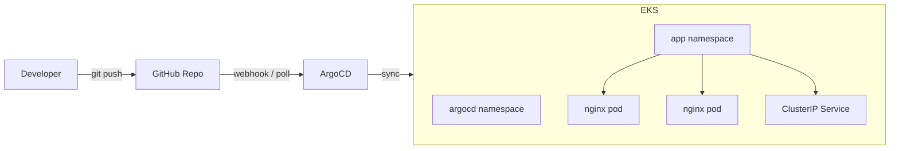

# Project 03 – EKS GitOps with ArgoCD

Manual kubectl deployments create configuration drift, lack audit trails, and don't scale across teams. This project implements a GitOps delivery pipeline where Git is the single source of truth — every change is version-controlled, peer-reviewed, and automatically reconciled to the cluster by ArgoCD.

## Overview

A production-style GitOps pipeline on Amazon EKS (Fargate) using ArgoCD for continuous delivery. Terraform provisions the infrastructure (VPC, EKS cluster, Fargate profiles, ArgoCD via Helm), and ArgoCD watches this repository for Kubernetes manifest changes and auto-syncs them to the cluster. A sample nginx application demonstrates the full push-to-deploy workflow.

## Architecture



## Key Features

- **GitOps delivery** — Git push triggers automatic cluster sync via ArgoCD
- **Self-healing** — ArgoCD reverts manual cluster changes to match the Git state
- **Automated pruning** — Deleted manifests are automatically removed from the cluster
- **Fargate-native** — No EC2 nodes to manage; pods run on serverless compute
- **Infrastructure as Code** — Full VPC, EKS, and ArgoCD provisioned with Terraform
- **CI validation** — GitHub Actions validates K8s manifests on every push

## Tech Stack

- **Cloud/IaC:** Terraform, AWS VPC, Amazon EKS, Fargate, IAM
- **GitOps:** ArgoCD (Helm-deployed), Application CRD
- **App:** nginx on Kubernetes (Deployment, Service, ConfigMap)
- **CI:** GitHub Actions (manifest validation + YAML lint)

## Prerequisites

- AWS CLI configured with appropriate credentials
- Terraform >= 1.9.0
- kubectl
- ArgoCD CLI (`brew install argocd` or [releases](https://github.com/argoproj/argo-cd/releases))
- Helm 3

## Quick Start

1. **Provision infrastructure**
   ```bash
   cd projects/03-eks-gitops-argocd/infra/terraform
   terraform init
   terraform apply
   ```

2. **Configure kubectl**
   ```bash
   aws eks update-kubeconfig --region us-east-1 --name gitops-demo
   ```

3. **Initialize ArgoCD**
   ```bash
   ./scripts/init-argocd.sh
   ```

4. **Verify the GitOps workflow**
   - Edit a file in `k8s/` (e.g., change replica count in `deployment.yaml`)
   - Commit and push
   - Watch ArgoCD sync: `argocd app get nginx-demo --watch --grpc-web`

## GitOps Workflow

```
1. Developer pushes manifest change to GitHub
2. GitHub Actions validates the YAML (dry-run + lint)
3. ArgoCD detects the new commit (polls every ~3 min)
4. ArgoCD compares desired state (Git) vs live state (cluster)
5. ArgoCD applies the diff — pods roll, services update
6. Self-heal: any manual cluster drift is reverted automatically
```

## Project Structure

```
03-eks-gitops-argocd/
  infra/terraform/       # VPC, EKS, Fargate, ArgoCD Helm release
  argocd/
    application.yaml     # ArgoCD Application CR
    helm-chart/values.yaml  # ArgoCD Helm overrides
  k8s/                   # App manifests (ArgoCD sync source)
    namespace.yaml
    deployment.yaml
    service.yaml
    configmap.yaml
  scripts/
    init-argocd.sh       # Post-deploy setup helper
  .github/workflows/
    deploy.yml           # CI manifest validation
```

## Cleanup

```bash
cd projects/03-eks-gitops-argocd/infra/terraform
terraform destroy
```

## Interview Talking Points

- **Why GitOps over CI/CD push?** GitOps provides a declarative, auditable, self-healing delivery model. The cluster always converges to what's in Git — no imperative scripts that can partially fail.
- **How does ArgoCD detect drift?** It polls the Git repo (configurable interval) and compares the rendered manifests against the live cluster state using a 3-way diff.
- **Why Fargate?** Eliminates node management overhead. Each pod runs in its own micro-VM, providing workload isolation without managing EC2 instances or AMI updates.
- **What happens if someone kubectl-edits a resource?** ArgoCD's self-heal reverts it within the next sync cycle, enforcing Git as the single source of truth.

## Why This Project Matters

GitOps is the standard delivery model for Kubernetes-native organizations. This project demonstrates the end-to-end pattern — IaC provisioning, Helm-managed platform components, declarative app delivery, and automated drift correction — the exact workflow used by platform teams at scale.
