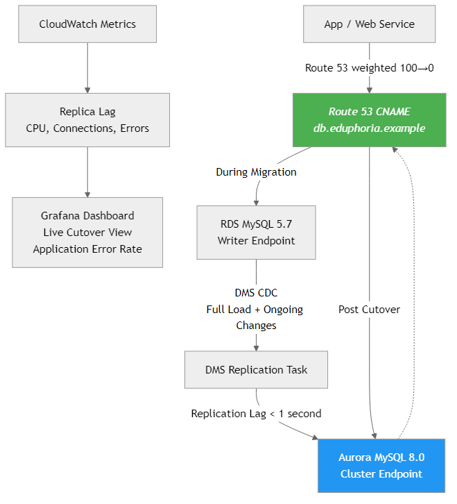

Project 04 – Aurora Zero-Downtime Migration

This project demonstrates a real-world migration from Amazon RDS MySQL to Amazon Aurora MySQL with near-zero downtime. The goal is to show how to modernize a production database safely, replicate data with minimal lag, and cut over with a reversible, low-risk approach.

The project simulates an environment where an application originally points to a traditional RDS MySQL instance. Using Terraform, Route 53, and replication features, the migration shifts the backend to Aurora without interrupting active workloads. This is the same type of operation SaaS companies perform when moving toward faster failover, better scalability, and reduced operational overhead.

Key Features

– RDS MySQL source instance provisioned through Terraform
– Aurora MySQL-compatible cluster deployed with separate instance definitions
– Replication pipeline using snapshot + binlog style sync behavior
– Route 53 CNAME record used as a blue/green switch between RDS and Aurora
– Custom scripts to validate replication health, perform cutover, and support rollback
– SQL baseline and migration files to simulate realistic DB changes
– Cutover and rollback runbooks included in the docs directory

What This Demonstrates

– How to architect and perform a controlled database migration
– How to minimize downtime using DNS-based switching
– How to validate replication state before cutover
– How to design a safe rollback plan in case of issues
– How to use Terraform for repeatable, version-controlled database infrastructure
– How to integrate migration procedures into DevOps workflows

How to Use This Project

1. Deploy the infrastructure using Terraform from the infra/terraform directory.
2. Apply the baseline schema from `sql/baseline/001_create_schema.sql` to the RDS instance.
3. Insert seed data using `sql/baseline/002_seed_data.sql` to populate initial records.
4. Start DMS replication task to begin syncing data to Aurora.
5. (Optional) Insert additional data using `sql/baseline/003_insert_during_migration.sql` to demonstrate CDC replication in real-time.
6. Run the replication check script to confirm synchronization and verify data consistency.
7. Use the cutover script to switch the Route 53 CNAME from RDS to Aurora.
8. Validate application connectivity and read/write operations on Aurora.
9. If issues occur, revert using the rollback script.

Repo Structure

– architecture.md: detailed migration flow and diagram context
– infra/terraform: full IaC for RDS, Aurora, networking, and Route 53
– sql: baseline and migration scripts to simulate real-world DB activity
– scripts: operational scripts for replication validation, cutover, and rollback
– docs: structured runbooks for predictable execution of changes

Why This Project Matters

Database migrations show up constantly in interviews for DevOps, Cloud, and Platform Engineering roles. This project demonstrates the ability to manage stateful workloads, plan safe migrations, automate infrastructure, and think about risk the same way production SaaS teams do.

